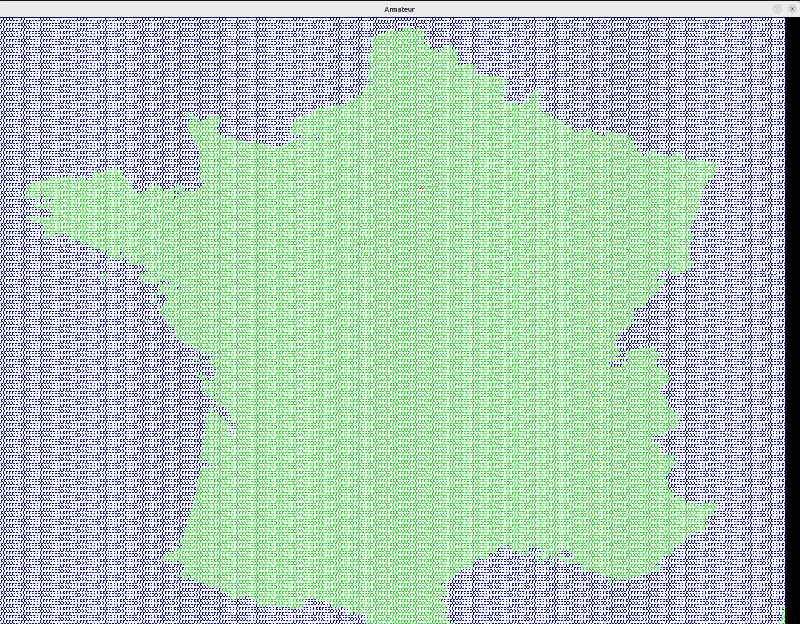

# armateur

Experimental project to assess the possibilities of `pygame`.

Given a source file describing a map, the application displays 
the map made with hexagonal tiles.

It is possible to scroll on the map and the hexagon hovered by the mouse 
is colored in red.

The display refresh rate is limited to 20 frame per second and the screen is
updated once per frame.

## Screenshots
Example of a map of France made with hexagonal tiles


## Usage
*Use with python3.8*

> **Note** : The application uses the outdated `1.9.6` version of pygame, 
> relying on the also outdated SDL 1.2 

Install dependencies
```commandline
pip install -r requirements.txt
```

Start the application
```commandline
python armateur/run.py
```
